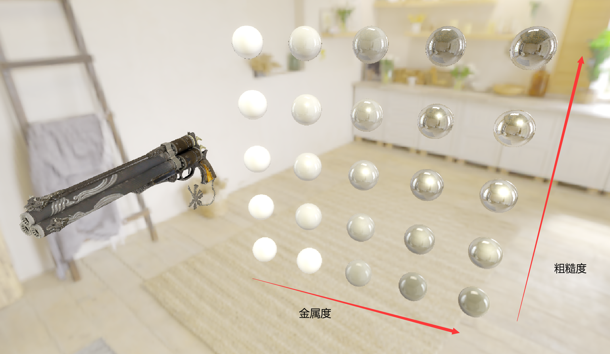
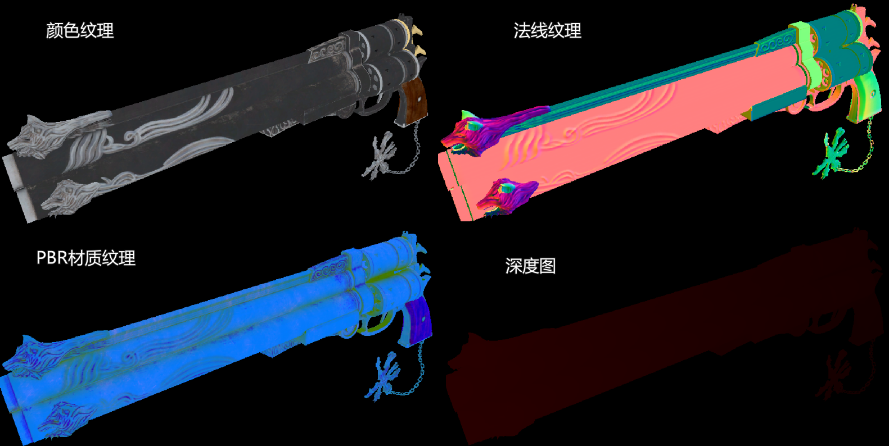
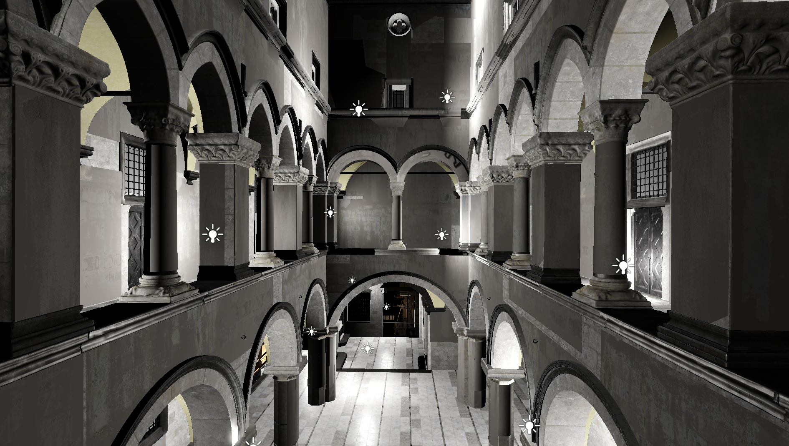
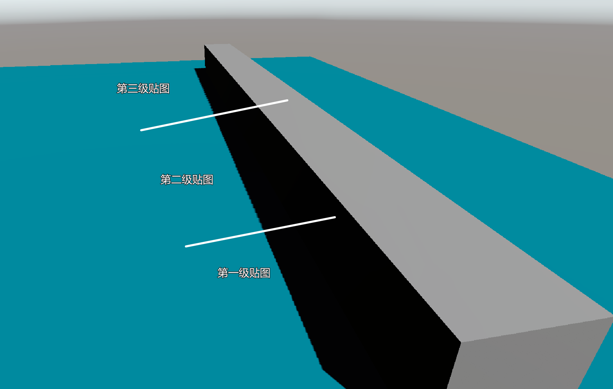
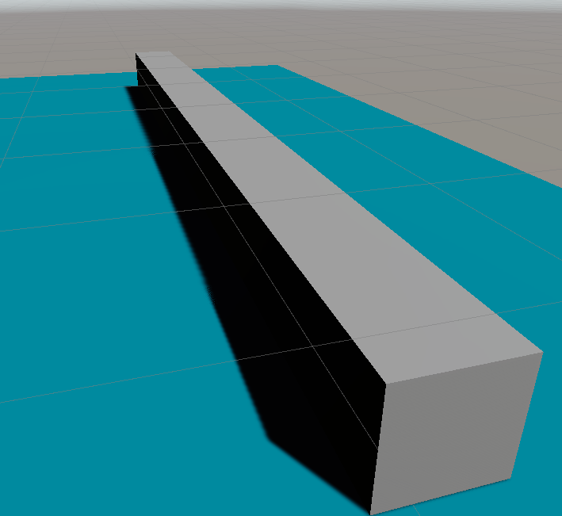
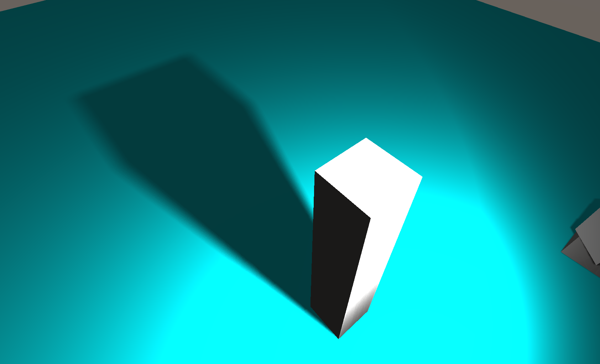
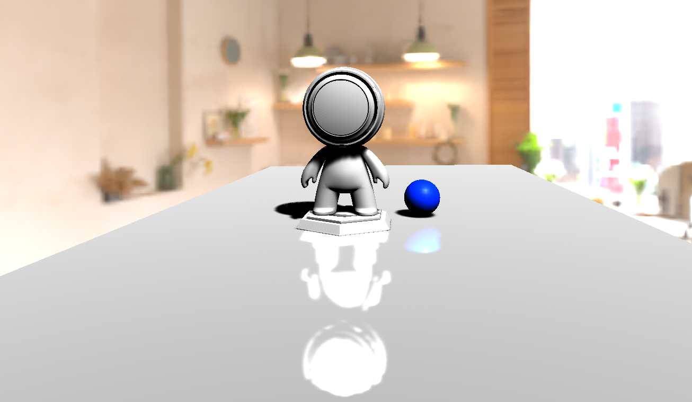
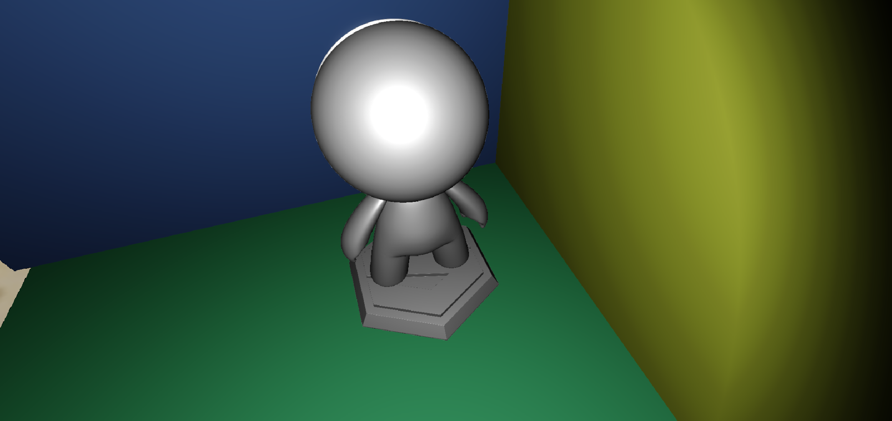
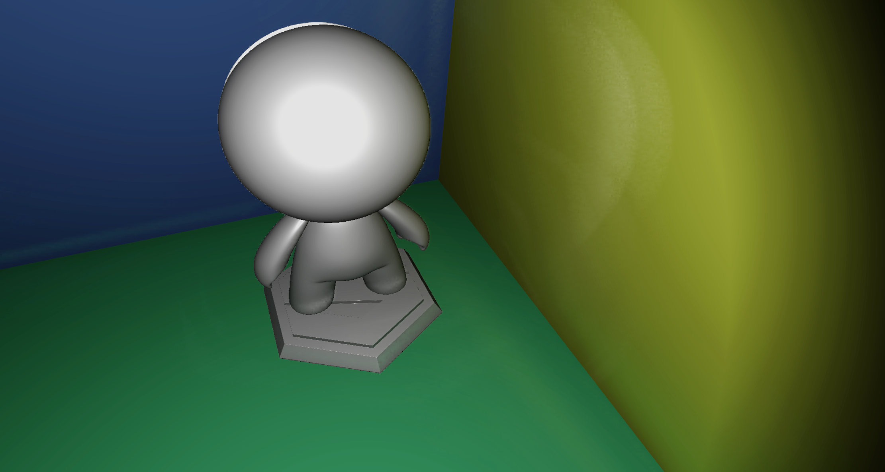
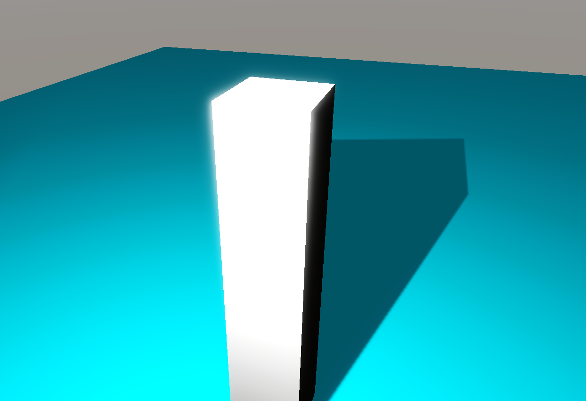

# SRPLearn

以学习为目的编写基于SRP的unity render pipeline . 

支持技术 : 支持前向渲染和延迟渲染 . 其中前向渲染支持半透明物体渲染 , 支持Forward+渲染 , 延迟渲染则支持分块延迟渲染 . 支持PBR , IBL ; 支持级联阴影 , PCSS软阴影和烘焙阴影 . 支持Reflective Shadow Map全局光照 , 延迟渲染下支持Screen Space Reflection . 支持Bloom , Tone mapping和Color Grading调色 . 

unity版本 : 2021.3.0f1c1 

API : DX11

---

## Gallery

### PBR&IBL

### 延迟渲染

### Tile based Light Culling	分块延迟渲染

多光源支持

### 级联阴影

四级深度图

PCF滤波后

### PCSS软阴影

### Screen Space Reflection

### Reflective Shadow Maps

RSM OFF

RSM ON

### Bloom

-----

## 参考

[1] [Catlike Coding SRP Tutorial](https://catlikecoding.com/unity/tutorials/custom-srp/)

[2] [Learn OpenGL](https://learnopengl-cn.github.io/)

[3] [GAMES202-高质量实时渲染](https://www.bilibili.com/video/BV1YK4y1T7yY/?spm_id_from=333.999.0.0&vd_source=774185395c65ff16d834c1d970a284f1)

[4] [【Unity】SRP简单入门](https://zhuanlan.zhihu.com/p/378828898)

[5] [在Unity里写一个纯手动的渲染管线](https://zhuanlan.zhihu.com/p/43588045)

[6] [Unity SRP 实战（一）延迟渲染与 PBR](https://zhuanlan.zhihu.com/p/458890891)

[7] [【Unity】Compute Shader的基础介绍与使用](https://zhuanlan.zhihu.com/p/368307575)

[8] [Unity SRP实现分块延迟渲染](https://zhuanlan.zhihu.com/p/401602488)

[9] [Unity SRP 实战（四）Cluster Based Lighting](https://zhuanlan.zhihu.com/p/464099000)

[10] [阴影的PCF采样优化算法](https://zhuanlan.zhihu.com/p/369761748)

[11] [自适应Shadow Bias算法](https://zhuanlan.zhihu.com/p/370951892)

[12] [级联阴影贴图CSM](https://zhuanlan.zhihu.com/p/368074616)

[13] [Cascade Shadow进阶之路](https://zhuanlan.zhihu.com/p/379042993)

[14] [高质量泛光（bloom）从理论到实战](https://zhuanlan.zhihu.com/p/525500877)

[15] [Reflective Shadow Maps](https://ericpolman.com/2016/03/17/reflective-shadow-maps/)

[16] [Unity Shader-反射效果（CubeMap，Reflection Probe，Planar Reflection，Screen Space Reflection）](https://blog.csdn.net/puppet_master/article/details/80808486)

[17] [3D Game Shaders For Beginners - Screen Space Reflection (SSR)](https://lettier.github.io/3d-game-shaders-for-beginners/screen-space-reflection.html)

[18] [[在Unity中实现屏幕空间反射Screen Space Reflection]](https://www.cnblogs.com/yangrouchuan/p/7574405.html)

[19] [Efficient GPU Screen-Space Ray Tracing](http://jcgt.org/published/0003/04/04/paper.pdf)

[20] [UnityGI](https://blog.csdn.net/Jaihk662/article/details/115445702?spm=1001.2101.3001.6650.7&utm_medium=distribute.pc_relevant.none-task-blog-2~default~BlogCommendFromBaidu~Rate-7-115445702-blog-118053393.235%5Ev38%5Epc_relevant_anti_vip_base&depth_1-utm_source=distribute.pc_relevant.none-task-blog-2~default~BlogCommendFromBaidu~Rate-7-115445702-blog-118053393.235%5Ev38%5Epc_relevant_anti_vip_base&utm_relevant_index=12)

[21] [Forward+ Shading](https://zhuanlan.zhihu.com/p/85615283)
